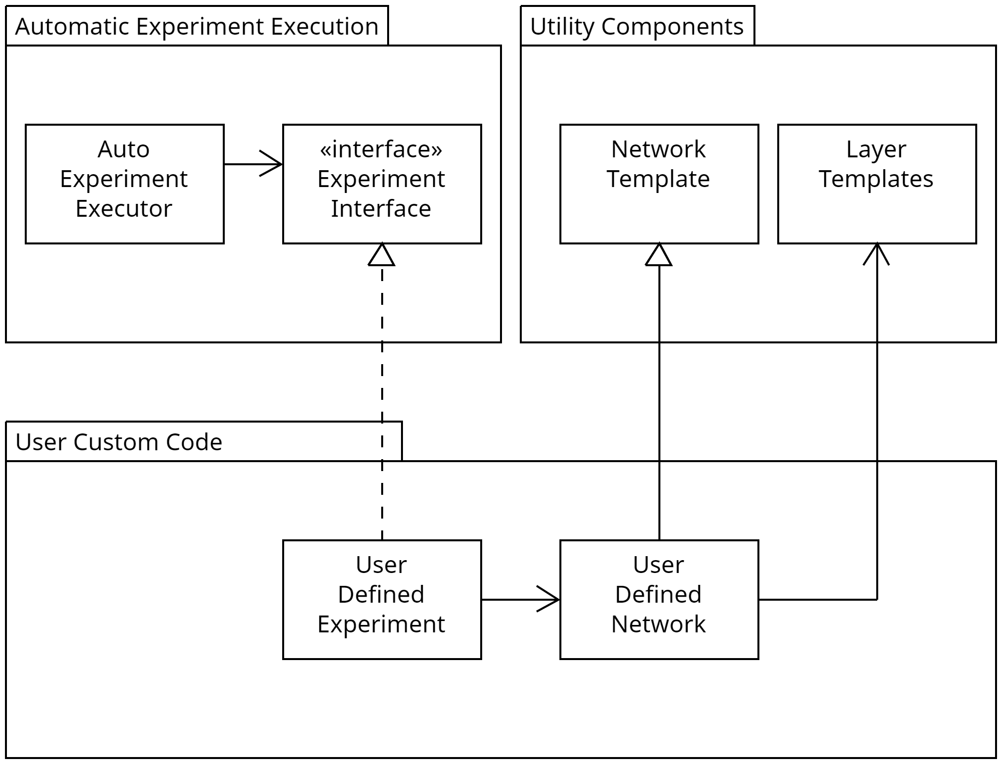

# Agile software development for Behavioral Time-scale Synaptic Plasticity(BTSP) experiments

## 概述

随着BTSP实验愈发繁多，为了每个实验单独进行代码开发将导致代码重复，维护困难。敏捷开发的目标是抽象并实现一套通用的实验框架，以便于快速开发新的实验。

问题：**本文档不符合Google开源项目代码风格规范**

## 基于用例分析

### 用例1: 自定义网络结构

用户通过对象组合的方式定义网络结构，每个调用的对象都是网络的一层，用户可以自由组合这些对象来构建自己的网络结构。

```python

class custom_network:
    def __init__(self):
        self.layer_1_forward = fly_hashing_layer()
        self.layer_2_forward = BTSP_layer()
        self.layer_2_backward = hebbian_layer()
```

### 用例2: 自定义网络行为

每个网络层都提供接口函数来控制行为，因此用户可以通过调用这些接口函数来自定义整个网络的行为。

```python

class custom_network:
    def __init__(self):
        self.layer_1_forward = fly_hashing_layer()
        self.layer_2_forward = BTSP_layer()
        self.layer_2_backward = hebbian_layer()

    def forward(self, input):
        output = self.layer_1_forward.forward(input)
        output = self.layer_2_forward.forward(output)
        return output

    def backward(self, input):
        output = self.layer_2_backward.backward(input)
        return output
    
    def learn(self, input):
        output = self.layer_1_forward.forward(input)
        self.layer_2_forward.learn(output)
        self.layer_2_backward.learn(output)
```

### 用例3: 权重控制

每个网络层在被实例化后的整个生命周期内都维护着自己的权重，用户可以通过调用接口函数来控制权重的变化。

```python

class custom_network:
    def __init__(self):
        self.layer_1_forward = fly_hashing_layer()
        self.layer_2_forward = BTSP_layer()
        self.layer_2_backward = hebbian_layer()

    def forward(self, input)

    def backward(self, input)

    def learn(self, input)

    def clear_weight(self)
        self.layer_1_forward.clear_weight()
        self.layer_2_forward.clear_weight()
        self.layer_2_backward.clear_weight()
```

### 用例4: 自动化实验

用户在创建好自己的网络之后，一般一个实验过程可以抽象成两个部分。首先，用户通过一定的给定参数初始化网络，然后用户调用一些自己定义的网络行为来进行实验。根据控制变量法，一个相同的实验可能在不同的参数下重复很多次。因此实验框架提供了一个自动化实验的接口函数，用户只需填写接口对象，在过程函数中填写自己的实验过程，在参数函数中填写字节的实验参数表（dict）。之后实例化这个对象，调用执行函数，这个函数就会遍历参数表中的每一组参数，利用这些参数初始化并执行实验，直到参数表中的所有参数都被遍历完。

```python
class AutoExperiment(ABC):
    """
    This is the abstract class for automatic experiments.
    """

    @abstractmethod
    def __init__(self):
        """
        This is the constructor of the class.
        """

    @abstractmethod
    def run(self):
        """
        This is the method that runs the experiment.
        """


class ExperimentInterface(ABC):
    """
    This is the abstract class for the experiment interface.
    """

    @abstractmethod
    def parameterize(self):
        """
        This is the method that parameterizes the experiment.
        """

    @abstractmethod
    def experiment_process(self):
        """
        This is the method that processes the experiment.
        """
```

## 第一次迭代

首版的实验框架结构如下：



主要包含两个模块：

- Automatic Experiment Execution Module
- Utility Components Module

使用时，用户只需在自己的Code Space内利用Utility Components Module中的类来定义自己的网络结构和行为，然后实例化一个Experiment Interface对象，将其传入Automatic Experiment Execution Module中的auto_experiment类，调用run函数即可。